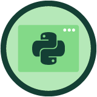

<a href="https://platzi.com/cursos/python-pip/">

<h1 align="center"><a href="https://platzi.com/cursos/python-pip/">Curso de Python: PIP y Entornos Virtuales</a></h1>

  

  Este proyecto fue hecho en VS Code con Jupyter Notebooks. Por
    <a href="https://github.com/DensLopez">Dennis.</a>
  

 
 

Este repositorio está relacionado al curso de <a href="https://platzi.com/cursos/python-pip/">"Curso de Python: PIP y Entornos Virtuales"</a> tomado en <a href="https://platzi.com">Platzi.</a> Además, contiene archivos ["ipynb"](codes) y ["html"](codes/html/) con los códigos desarrollados en el curso y explicaciones por cada archivo.
 

<h1 align="center">Acerca de </h1>
¡Aprende a desarrollar con Python en tu propio entorno local! Configura Python en tu sistema operativo, instala dependencias con PIP y aísla tus proyectos en entornos virtuales para evitar conflictos entre módulos y sus versiones. Encapsula tus aplicaciones en contenedores de Docker y descubre cómo trabajar en equipo profesionalmente junto a tu profesor Nicolas Molina.

 

## Temario

### Introducción

- Python en tu propio entorno de desarrollo local - [code001.ipynb](codes/code001.ipynb), [code001.html](codes/html/code001.html)
- Instalación en Windows (WSL) y Linux - [code002.ipynb](codes/code002.ipynb), [code002.html](codes/html/code002.html)
- Instalación en Mac - [code003.ipynb](codes/code003.ipynb), [code003.html](codes/html/code003.html)
- Python con VSCode - [code004.ipynb](codes/code004.ipynb), [code004.html](codes/html/code004.html)
- Python con Git y GitHub - [code005.ipynb](codes/code005.ipynb), [code005.html](codes/html/code005.html)
- Flujo de trabajo en Python - [code006.ipynb](codes/code006.ipynb), [code006.html](codes/html/code006.html)

### PIP Y Entornos virtuales

- ¿Qué es PIP? - [code007.ipynb](codes/code007.ipynb), [code007.html](codes/html/code007.html)
- Gráficas en Python con PIP - [code008.ipynb](codes/code008.ipynb), [code008.html](codes/html/code008.html)
- ¿Qué es un ambiente virtual? - [code009.ipynb](codes/code009.ipynb), [code009.html](codes/html/code009.html)
- Usando entornos virtuales - [code010.ipynb](codes/code010.ipynb), [code010.html](codes/html/code010.html)
- Requirements.txt - [code011.ipynb](codes/code011.ipynb), [code011.html](codes/html/code011.html)

### Práctica

- Solicitudes HTTP con requests - [code012.ipynb](codes/code012.ipynb), [code012.html](codes/html/code012.html)
- Pandas - [code013.ipynb](codes/code013.ipynb), [code013.html](codes/html/code013.html)
- Python para Backend: web server con FastAPI - [code014.ipynb](codes/code014.ipynb), [code014.html](codes/html/code014.html)

### Python en contenedores de Docker

- ¿Qué es Docker? - [code015.ipynb](codes/code015.ipynb), [code015.html](codes/html/code015.html)
- Instalación de Docker - [code016.ipynb](codes/code016.ipynb), [code016.html](codes/html/code016.html)
- Dockerizando scripts de Python - [code017.ipynb](codes/code017.ipynb), [code017.html](codes/html/code017.html)
- Docker para el día a día: automatizando la vinculación de archivos - [code018.ipynb](codes/code018.ipynb), [code018.html](codes/html/code018.html)
- Dockerizando web services - [code019.ipynb](codes/code019.ipynb), [code019.html](codes/html/code019.html)

### Próximos pasos

- ¿Cómo continuar tu carrera profesional con Python? - [code020.ipynb](codes/code020.ipynb), [code020.html](codes/html/code020.html)
- [Examen final](codes/pdf/03.- Examen.pdf)

 
